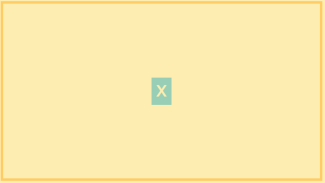
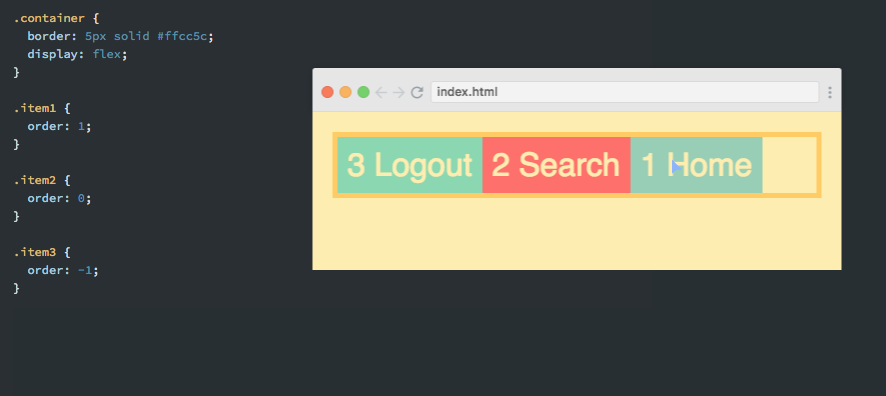

# Flexbox in the Batcave

Flexbox must have a container and elements
```HTML
<nav class="container">
    <div>Home</div>
    <div>Search</div>
    <div>Logout</div>
</nav>
```

The container:
* Has a main axis (horizontal)
* Has a cross axis (vertical)
```CSS
.container{
    display:flex; 
    flex-direction: row; /* do you want the container to read vertically or horizontally? */
    justify-content:  flex-start;  /* justifies the elements */ 
    /* flex-start, flex-end, center, space-around, space-between, space-evenly */
}
```
### Flex-start:

### Flex-end:

### Center:

### Space-around:

### Space-between:

### Space-evenly:


```CSS
.search{
    margin-left:auto;
}
```
### Margin-left:


The items:
* Control the width of the flex items
```CSS
.items{
    flex:1;
    /*flex-grow, flex-shrink, flex-basis*/
}
```
* Control the height of the flex items
```CSS
.items{
    align-items:stretch;
    /*stretch, flex-start, flex-end, center */
}
```

### Center a button:
```CSS
.container {
  border: 5px solid #ffcc5c;
  display: flex;
  height: 100%;
  align-items: center;
  justify-content: center;
}
```


### Flex Wrap:
```CSS
.container {
  border: 5px solid #ffcc5c;
  display: flex;
  flex-wrap: wrap;
}
```

### Flex Order:
```CSS
.container {
  border: 5px solid #ffcc5c;
  display: flex;
}
.item1 {
  order: 1;
}
```


# CSS variables
CSS variables are also known as Custom Properties